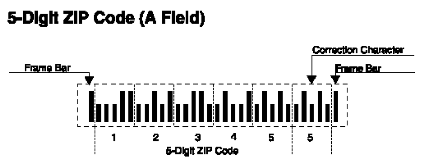

# Project 4 - Functions

You will write a program that defines and uses its own functions. You will also
use the string class that is provided by the C++ standard.

## Important Links

- Review the [grading rubric](https://shanepanter.com/cs452/grading-rubric.html)

## Objectives

- Use cin to read data from the user
- Use cout to output to the standard output stream
- Use if/else statements
- Write your own functions
- Use methods provided by the string object
- Use an Iterator
- Use a std::vector to collect all the input from the user

## Task 1 - Generate Build Files

There are two scripts in the root directory named `clean.sh` and `release.sh`.
One creates a release build to compile your project and the other will delete
all the temporary files that are created during the build process.

Run the `release.sh` script from the terminal to setup your project. Note
that your output will be slightly different than what is shown below because
cmake configures the build system specific to the system that it is running on.

```bash
shane|(master *%=):solution$ ./release.sh
-- The CXX compiler identification is AppleClang 14.0.3.14030022
-- Detecting CXX compiler ABI info
-- Detecting CXX compiler ABI info - done
-- Check for working CXX compiler: /Library/Developer/CommandLineTools/usr/bin/c++ - skipped
-- Detecting CXX compile features
-- Detecting CXX compile features - done
-- Configuring done
-- Generating done
-- Build files have been written to: ...
```

## Task 2 - Convert Barcode's to Zip Codes

For faster sorting of letters, the United States Postal Service encourages
companies that send large volumes of mail to use a bar code denoting the zip
code.



The encoding scheme for a five-digit zip code is shown in the figure above.
There are full-height frame bars on each side. The five encoded digits are
followed by a check digit, which is computed as follows: Add up all digits, and
choose the check digit to make the sum a multiple of 10. For example, the zip
code 95014 has a sum of 19, so the check digit is 1 to make a sum equal to 20.
Each digit of the zip code, and the check digit, is encoded according to
table below where 0 denotes a half bar and 1 a full bar.

| Digit | Bar 1 (weight 7) | Bar 2 (weight 4) | Bar 3 (weight 2) | Bar 4 (weight 1) | Bar 5 (weight 0) |
| ----- | ---------------- | ---------------- | ---------------- | ---------------- | ---------------- |
| 1     | 0                | 0                | 0                | 1                | 1                |
| 2     | 0                | 0                | 1                | 0                | 1                |
| 3     | 0                | 0                | 1                | 1                | 0                |
| 4     | 0                | 1                | 0                | 0                | 1                |
| 5     | 0                | 1                | 0                | 1                | 0                |
| 6     | 0                | 1                | 1                | 0                | 0                |
| 7     | 1                | 0                | 0                | 0                | 1                |
| 8     | 1                | 0                | 0                | 1                | 0                |
| 9     | 1                | 0                | 1                | 0                | 0                |
| 0     | 1                | 1                | 0                | 0                | 0                |

The digit can be easily computed from the bar code using the column weights
7,4,2,1,0. For example, 01100 is 0 x 7 + 1 x 4 + 1 x 2 + 0 x 1 + 0 x 0 = 6. The
only exception is 0, which would yield 11 according to the weight formula.

Your program should allow the user to input as many barcode's as they wish, you
will need to collect them all in a `std::vector`. The barcode entry will be
terminated with an input of -1. You will then iterate through the vector and
convert each barcode to its zip code.

### Sample output

```bash
$ ./myprogram
||:|:::|:|:||::::::||:|::|:::|||
||::|:::||:|:::|||::::|::||::|:|
-1
----------
95014
83704
done
```

⚠ You **MUST** use functions for this program! You will lose points if you write
the whole program in main!

## Task 3 - Convert Zip Codes to Barcode's or Vice Versa

You may notice that once you are finished with the previous task, it is easy to
now convert zip codes to their barcode. Update your program to allow you to now
input zip codes and barcode's at the **same time** and convert each one into the
other respectively. In the example below you can see that 3 zip codes and 1
barcode entered and each was converted to is counter part 😃!

```bash
$ ./myprogram
83704
83705
83276
||:|:::|:|:||::::::||:|::|:::|||
-1
----------
||::|:::||:|:::|||::::|::||::|:|
||::|:::||:|:::|||::::|:|:|:::||
||::|:::||:::|:||:::|:||:::|::||
95014
done
```

## Task 3 - Testing

Your instructor will provide you with testing scripts that were demonstrated in
class to help guide your development. These will be posted in canvas along with
instructions on how to use them in your project.

## Task 5 - Complete the Retrospective

Once you have completed all the tasks open the file **Retrospective.md** and
complete each section that has a TODO label. Reference the grading rubric
for details on how this will be graded.

## Task 6 - Add, Commit, Push your code

Once you are finished you need to make sure that you have pushed all your code
to GitHub for grading! You will not be submitting anything to canvas everything
will be submitted through GitHub as demonstrated in class.
